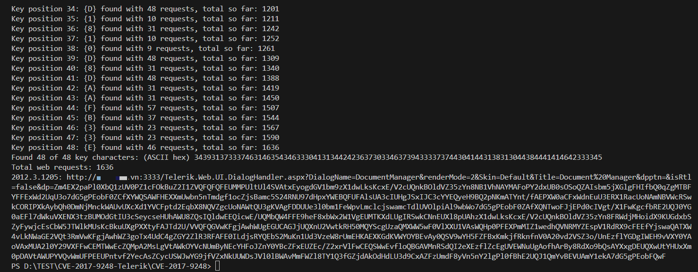
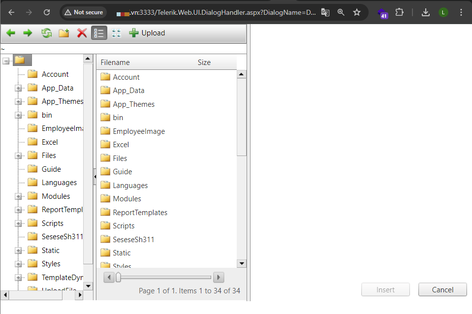

# CVE-2017-9248 | Telerik ASP.NET AJAX

## Description

Module Text Editor in Telerik UI for ASP.NET AJAX provide feature "File Manager" in URI ``/Telerik.Web.UI.DialogHandler.aspx``.

The full URI with params is

```
/Telerik.Web.UI.DialogHandler.aspx?DialogName=DocumentManager&renderMode=2&Skin=Default&Title=Document%20Manager&dpptn=&isRtl=false&dp=XXX
```

The vulnerability occur in the ``dp`` param. It is an serialized object, containing other param for config the File Manager Box, such as directory, insecure file extension, ...

Because of lost secure in the logic code of the affected versions, there are some way to bruteforce each character of the encryption key.

Briefly, the equation of the encryption is xxx => decode_base64 =>  xor(,key) => decode_base64  => deserialize

When fuzzing the param ``dp``, we can receice 03 different message:

- Invalid length


- Containing non-base64 character


- extract_params cannot be using. (XOR is susccessfully)


Because XOR is the alg which encrypting each character of the output, we can use it to bruteforce each one of the right key encryption

# Impact

The Vulnerability do not only provide the tree folder of the webroot, the attacker can config the allow file-upload pattern to *.*

At the results, attacker can upload webshell and Remote the victim server.

# Reproducing

Use the python script to automatically bruteforce the encryption key and create the URL to the File Manager box of webroot





Create a custom folder and upload a webshell aspx onto it and RCE!!!
